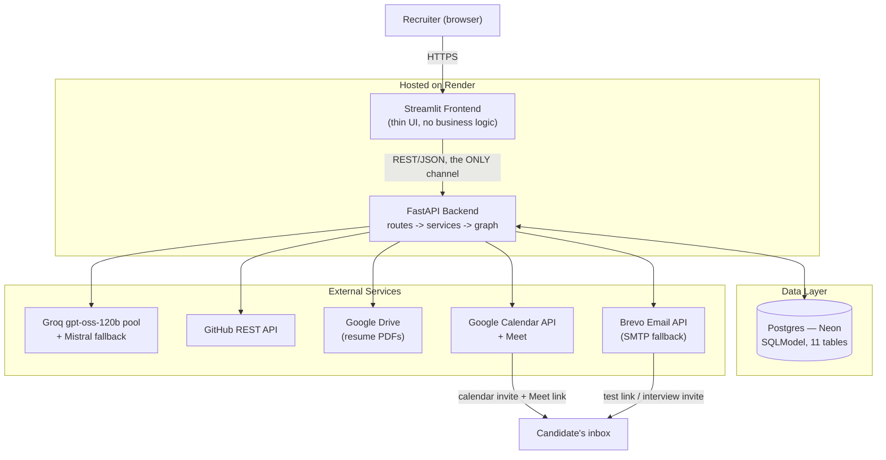
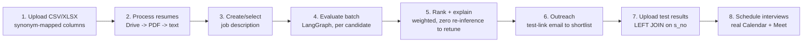
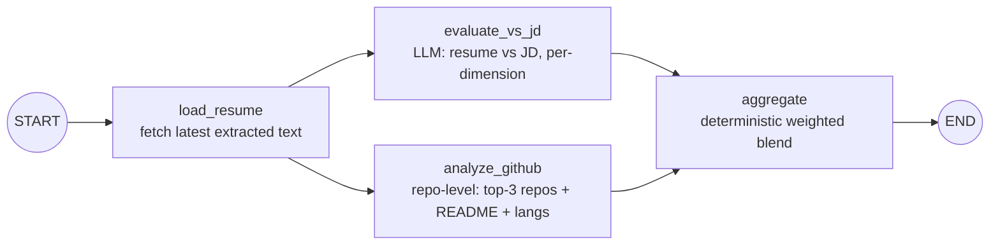

# Architecture — AI Screening Platform

Visl AI Labs' candidate screening platform: ingest a candidate dataset,
evaluate each candidate against a job description with an LLM, analyze their
GitHub at repository level, score and rank deterministically, email a test
link to the shortlist, ingest test results, and schedule interviews on Google
Calendar with a real Meet link — end to end, with no manual step in between.

## 1. High-Level Design



**Why this shape.** The frontend is a pure HTTP client (`frontend/lib/api_client.py`
is the *only* module that talks to the backend) — it never imports backend code
and holds no business logic, so the backend can be re-skinned or driven by any
other client without change. The backend is stateless between requests; all
state lives in Postgres, so it can be redeployed or scaled to N instances with
no session affinity. Every external dependency (LLM, GitHub, email, Calendar)
sits behind its own `services/` module, so a provider swap (already exercised
twice — Gmail → Resend → Brevo, and Groq → Mistral on rate-limit) is a config
change, not a rewrite.

## 2. End-to-End Workflow



Every arrow is a recruiter action through the Streamlit UI, backed by one
FastAPI endpoint. Each stage persists incrementally (one candidate/row at a
time, not at batch end) and degrades a single failure to a logged error
rather than aborting the batch — a dead resume link or a candidate with no
GitHub profile never blocks the other nine.

## 3. Agentic Evaluation Pipeline (LangGraph)

One compiled graph, invoked once per candidate (`backend/graph/pipeline.py`):



| Node | Does | On failure |
|---|---|---|
| `load_resume` | Reads the candidate's extracted resume text | Missing text is not fatal — evaluation proceeds on dataset fields alone |
| `evaluate_vs_jd` | LLM scores skills match, project depth, experience relevance, research — each with `score` + `reasoning` + `evidence` | `resume_score` stays `None` (never 0) so weight redistributes |
| `analyze_github` | Fetches repos, drops forks, ranks by recency/stars/substance, sends top 3 (README + language breakdown) to the LLM alongside deterministic signals | `NO_PROFILE`/`NOT_FOUND` are normal states, not errors; only a real API failure is logged |
| `aggregate` | Pure Python: blends `resume_score` + `github_score` into `pre_test_score` | Never raises — computes from whatever is available |

`evaluate_vs_jd` and `analyze_github` fan out in parallel and converge on
`aggregate`; every node try/excepts internally and writes to a shared
`errors` list (merged via an `operator.add` reducer) instead of raising, so
one candidate's exception can never take down the batch. The graph is
compiled once at import and reused for all candidates.

**Scoring is never LLM-computed.** The LLM only emits structured
per-dimension scores with reasoning; `services/scoring.py` does the
arithmetic:

```
pre_test = 0.40·resume_jd + 0.25·github + 0.20·projects + 0.15·academics
final    = 0.60·pre_test  + 0.20·test_la + 0.20·test_code
```

Weights are config, not code — recruiters retune the resume/GitHub blend and
re-rank instantly from stored scores, with **zero new LLM or GitHub calls**.

**Resilience:** Groq calls run through a round-robin pool of API keys (each
an independent free-tier token bucket on the same model); a 429 rotates to
the next key with a cooldown, and the pool falls back to Mistral only when
every key is cooling down. `fast` mode (deployment default) favors speed by
dropping to Mistral immediately; `quality` mode waits for a Groq key so every
candidate is scored by the same model. Every external call (DB, GitHub, LLM,
email, Calendar) is wrapped in `tenacity` retry with exponential backoff.

## 4. Scaling

The design already carries the pieces that matter; scaling up is mostly
config and infrastructure, not a rewrite.

- **Backend** — stateless between requests, all state in Postgres, so it runs
  behind a load balancer as N identical instances with no session affinity.
- **Evaluation throughput** — each candidate's graph run is independent
  (embarrassingly parallel). Today they run in-process a few at a time; the
  next step is a job queue (Arq / Celery / RQ) with a worker pool that scales
  on batch size.
- **LLM capacity** — add keys to `GROQ_API_KEYS` (the pool picks them up with
  no code change); on a paid tier set `BATCH_STAGGER_SECONDS=0` and raise
  `BATCH_CONCURRENCY` and the pipeline runs fully parallel with no fallback.
- **GitHub** — already cached per username in the DB; a PAT pool (same
  round-robin pattern as the LLM keys) lifts the rate ceiling further.
- **Database** — move off Neon's free tier to a pooled instance with read
  replicas for the read-heavy dashboard; add Redis for hot dashboard reads.
- **Provider swaps are config** — LLM, email, and the DB URL each change in
  one place, so moving to a bigger or faster provider is a settings change.
- **Multi-tenant** — the current single shared DB has no per-user isolation;
  scoping batches/runs to an account id and adding auth is the main product
  change needed for real multi-recruiter use.

## 5. Constraints

- **Free tier only, everywhere** — Groq (rate-limited), Neon Postgres (scales
  to zero when idle — connections use `pool_pre_ping` + recycle), Render
  (cold starts, and outbound SMTP ports are blocked at the platform level,
  which is why email goes over Brevo's HTTPS API, not SMTP, in production).
- **Open-source LLM preferred** — `openai/gpt-oss-120b` on Groq is primary;
  Mistral is the fallback only.
- **Real Google Calendar integration, no mocks** — events must actually
  appear on a calendar with a working Meet link (`conferenceDataVersion=1` is
  mandatory; without it Google silently drops the Meet link).
- **GitHub analysis must be repository-level** — profile stats alone
  (followers, total stars) do not satisfy this; individual repos are fetched
  and their contents evaluated.
- **Dynamic schema, not a fixed CSV shape** — columns are matched
  case-insensitively via a synonym map; an unmappable required column fails
  with a named error, never a `KeyError`.
- **Python 3.11**, both apps publicly hosted, deadline-bound scope — polish
  is cut before Calendar integration or hosting ever is.

## 6. What a Recruiter Can Do

- Upload any similarly-shaped candidate CSV/XLSX — no fixed column order.
- Trigger resume download + extraction and LLM evaluation with one click
  each; watch live progress and partial results as a batch runs.
- Choose `fast` vs `quality` evaluation mode as a speed/consistency trade-off.
- See **every** score's reasoning and quoted evidence, not just a number —
  per resume dimension and per GitHub dimension.
- Re-weight the resume/GitHub blend and re-rank instantly, with **zero**
  inference cost, to explore "what if projects mattered more."
- Preview a shortlist by top-N or score threshold before anything is sent;
  send test-invite emails, with a force-resend option.
- Upload test results at any time — missing rows are never scored zero, and
  the final blend weights are separately tunable.
- Schedule interviews by top-N or final-score threshold, with custom working
  hours, slot length, gap, and timezone; cancel and re-book.
- See a per-batch pipeline-progress bar and a live dashboard (candidates,
  GitHub coverage, emails sent, interviews scheduled) on every page, not just
  the page just visited.

## 7. What Sets This Platform Apart

- **Explainable by construction, not by add-on** — every dimension the LLM
  touches carries `score` + `reasoning` + `evidence`; the UI surfaces all of
  it, because it was never thrown away in the first place.
- **Scoring is deterministic and auditable** — the LLM never outputs a final
  number. A recruiter can see exactly why two candidates are 2 points apart,
  and change the formula's weights without re-running inference.
- **GitHub analysis reads code, not vanity metrics** — top repos are
  selected by recency/stars/substance, forks dropped, README + languages
  sent to the LLM; a candidate with 10,000 followers and no original repos
  scores on substance, not reputation.
- **Provider-agnostic and already proven so** — the LLM, email, and (in
  design) the DB session boundary are all swappable via one config value;
  this was exercised for real mid-project (Gmail → Brevo, Groq → Mistral),
  not just designed for hypothetically.
- **Real infrastructure, not a demo stub** — Calendar events carry working
  Meet links today, on the free tier, with no mocked response anywhere in
  the path.
- **Failure is a data point, not a crash** — a dead resume link, a missing
  GitHub profile, a missing test score, or a throttled LLM key each degrade
  to an explicit state (`NO_RESULT`, `NO_PROFILE`, a logged error) that the
  UI shows plainly, while the rest of the batch keeps moving.
