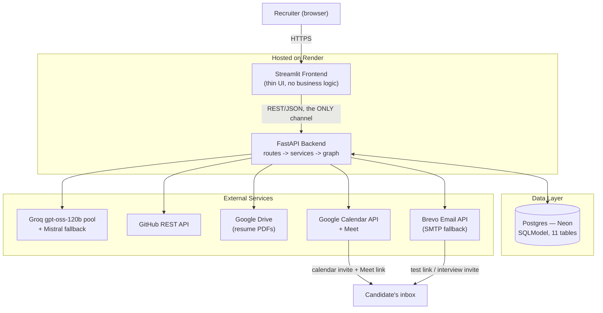
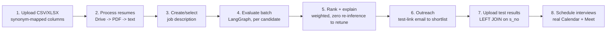
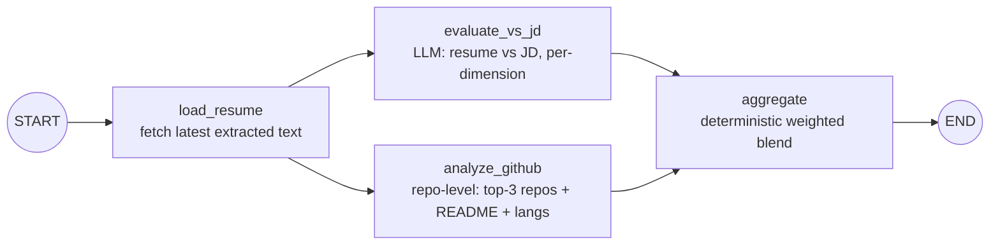
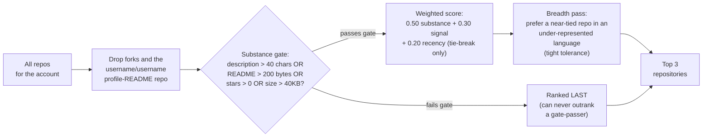
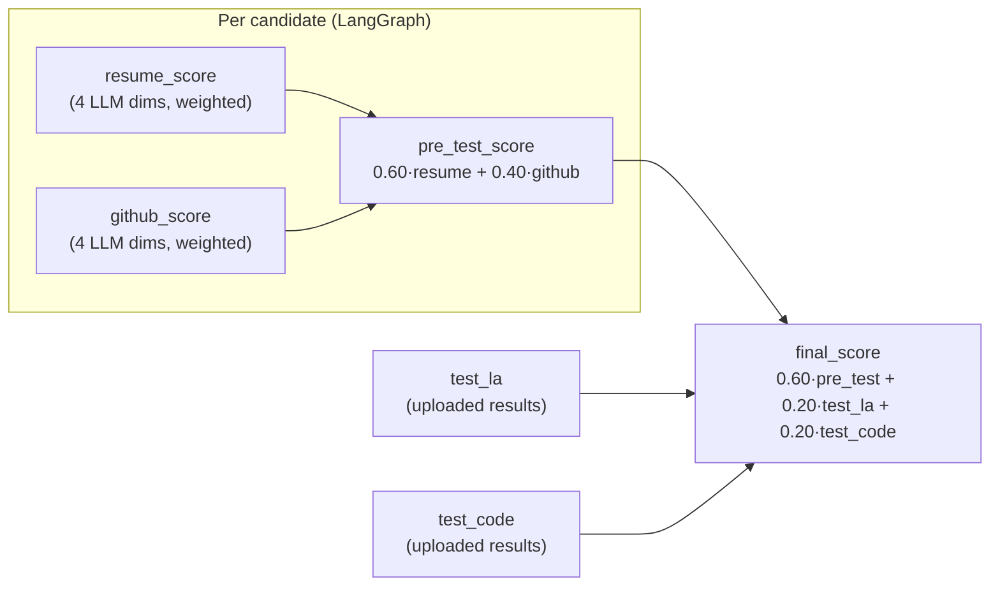
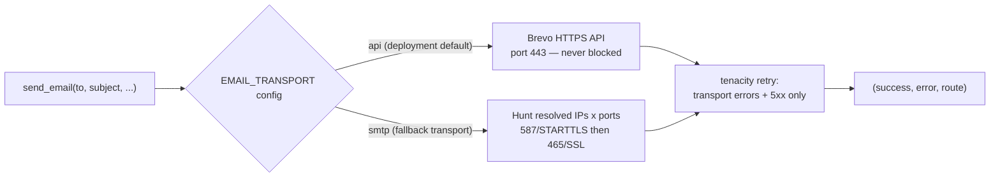

# AI Screening Platform — Full Project Report

**Visl AI Labs assignment — Aayush Gupta**

---

## 1. Executive Summary

The AI Screening Platform automates first-round candidate screening end to
end. A recruiter uploads a candidate dataset; the system downloads and reads
every resume, evaluates each candidate against a job description with an LLM,
analyzes their GitHub at the repository level, computes a deterministic
multi-dimensional score, emails a test link to the shortlist, ingests the
scored results, blends them into a final ranking, and schedules interviews on
Google Calendar with real Meet links — with no manual step anywhere in that
chain.

The system is built as a thin Streamlit dashboard talking to a stateless
FastAPI backend, with a LangGraph pipeline doing the actual per-candidate
reasoning. Every score the platform produces is explainable: the LLM is
never allowed to output a final number, only per-dimension judgments with
quoted evidence, and a separate deterministic layer does all the arithmetic.
The whole stack runs on free-tier infrastructure (Groq, Neon Postgres,
Render, Brevo, Google Calendar), and every provider sits behind a config
value so it can be swapped without touching business logic — a swap that
was exercised for real during development (Gmail → Brevo for email, a
primary/fallback LLM pool for inference).

This report documents the system end to end: architecture, the exact
working of every agent in the evaluation pipeline, the scoring and GitHub
analysis methodologies, the supporting services (ingest, email, calendar),
the frontend, resilience patterns, deployment, and how the system scales
beyond its current free-tier footprint.

---

## 2. Problem Statement and Requirements

Manual resume screening does not scale: a recruiter reading every resume
by hand cannot fairly weigh technical projects, cross-check GitHub activity,
and coordinate test invites and interview scheduling for a large candidate
pool. The assignment asked for a system that automates this pipeline while
satisfying several hard constraints:

- The candidate dataset schema is **not fixed** — the system must accept a
  differently-labelled CSV/XLSX without code changes.
- GitHub evaluation must be **repository-level** — a candidate's follower
  count or total stars is not an acceptable proxy for engineering ability.
- Google Calendar integration must be **real** — no mocked events, no fake
  Meet links.
- The preferred LLM is an **open-weights model**, not a closed frontier API.
- The whole system must be **publicly hosted**, not just runnable locally.

Beyond the functional checklist, the deeper problem is trust: a scoring
system that recruiters cannot interrogate is not useful in a hiring context.
Every design decision in this platform — structured LLM output, deterministic
aggregation, explicit "missing" states instead of zeros — traces back to
making the ranking auditable, not just automated.

---

## 3. Technology Stack

| Layer | Choice | Reasoning |
|---|---|---|
| Backend | FastAPI + Uvicorn | Async-native, typed request/response models, auto-generated `/docs` |
| Orchestration | LangGraph | Per-candidate evaluation is naturally a small DAG (fan-out / fan-in); LangGraph gives that structure, state merging, and node-level isolation for free |
| LLM I/O | LangChain (`langchain-groq`, `langchain-mistralai`) | Structured-output binding (`with_structured_output`) works uniformly across providers |
| Frontend | Streamlit | Fastest path to a working dashboard; kept strictly to a thin HTTP client role |
| Database | Postgres (Neon, free tier) via SQLModel | Real persistence (not SQLite, which would vanish on a Render redeploy's ephemeral filesystem); SQLModel gives one class for both the ORM table and the Pydantic-validated shape |
| Primary LLM | Groq, `openai/gpt-oss-120b` | Open-weights, satisfies the assignment's stated preference, fast inference |
| Fallback LLM | Mistral, `ministral-8b-latest` | Used only when every Groq key in the pool is rate-limited |
| Email | Brevo HTTPS API (SMTP kept as a secondary transport) | Render blocks outbound SMTP ports at the platform level (see §11) |
| Calendar | Google Calendar API (OAuth refresh token) | Real events, real Meet links |
| GitHub | GitHub REST API (authenticated PAT) | 5000 req/hr vs. 60 unauthenticated |
| Hosting | Render (free tier), both services | Public URLs, auto-deploy from GitHub |
| Python | 3.11 | Pinned via `runtime.txt` — some dependency wheels don't build cleanly on 3.12+ |

Every one of these is a free tier or open-source choice. §13 covers what
changes on a paid tier.

---

## 4. High-Level Architecture



**Why this shape.** The frontend (`frontend/lib/api_client.py`) is the
*only* module that talks to the backend, and it never imports backend code —
so the backend can be re-skinned or driven by a different client entirely
without change. The backend is stateless between requests: every bit of
durable state lives in Postgres, which means the backend can be redeployed,
restarted, or scaled to N instances with no session affinity. Every external
dependency (LLM, GitHub, email, Calendar) sits behind its own `services/`
module, so a provider swap is a configuration change, not a rewrite — this
was proven twice in practice: the email transport moved from Gmail SMTP to
Resend to Brevo SMTP to Brevo's HTTPS API without touching the calling code
in `services/outreach.py` or `services/interviews.py`, and the LLM moved
from a single Groq key to a round-robin pool with a Mistral fallback without
touching `graph/nodes.py`.

---

## 5. End-to-End Workflow



Each arrow is one recruiter action in the Streamlit UI, backed by exactly
one FastAPI endpoint. Every stage persists **incrementally** — one
candidate or one row at a time, never buffered to the end of a batch — so a
crash mid-batch loses nothing already computed. Every stage also degrades a
single failure to a logged, visible error rather than aborting the whole
batch: a dead resume link, a 404'd GitHub username, or one candidate's
LLM timeout never blocks the other candidates.

---

## 6. Data Model

Eleven SQLModel tables, all in Postgres:

| Table | Holds |
|---|---|
| `upload_batch` | One row per candidate-file upload (dedup by content hash) |
| `candidate` | One row per candidate, keyed by a surrogate `candidate_id` (never email — see §7) |
| `job_description` | Recruiter-authored or selected job descriptions |
| `resume_text` | Extracted resume text per candidate, plus an error field if extraction failed |
| `github_analysis` | The persisted GitHub evaluation payload per candidate (per job) |
| `github_cache` | Raw GitHub API responses keyed by username — avoids re-fetching on every batch re-run during development |
| `evaluation` | The full per-candidate scoring record: resume eval, GitHub eval, weights used, `pre_test_score`, `final_score`, status |
| `test_result` | Uploaded test scores, `s_no`-keyed, with an explicit `NO_RESULT` status |
| `interview` | One row per (candidate, run) — event id, Meet link, times, status |
| `email_log` | One row per send attempt (sent or failed), never deduplicated by email address |
| `pipeline_run` | The progress row the frontend polls (`pending → running → completed/failed`) |

Two schema decisions are load-bearing and worth calling out explicitly:

1. **`candidate_id` is a surrogate key, not email.** The sample dataset has
   all ten candidates sharing one email address (`...+arnav@...`), and the
   test-results file uses a *different* shared address
   (`...+assignment@...`). Any join or dedup keyed on email would either
   collapse all ten candidates into one record or fail to match a single
   row across the two files. Every join in the system goes through
   `candidate_id` or, for the results upload specifically, `s_no`.
2. **`Evaluation.weights` and `Evaluation.final_weights` are persisted
   alongside every score.** A score is only auditable if the exact weights
   used to produce it are recoverable later — this is what lets the
   `/rerank` and `/results/shortlist` endpoints recompute a ranking from
   stored dimension scores with zero new LLM calls (§10).

---

## 7. Ingestion — Handling a Dynamic, Messy Dataset

`services/ingest.py` accepts CSV or XLSX with **no fixed column order or
naming**. Headers are normalized (`"GitHub Profile "` → `github_profile`)
and matched against a synonym table:

```
s_no            -> {s_no, sno, sr_no, serial, serial_no, id, index}
name            -> {name, full_name, candidate_name, student_name}
email           -> {email, email_address, mail, email_id}
github          -> {github, github_profile, github_url, github_link, git}
resume          -> {resume, resume_link, resume_url, cv, cv_link, resume_drive}
... (college, branch, cgpa, best_ai_project, research_work similarly)
```

Only `name` and `email` are hard-required; a missing one raises a named
`ValueError` listing exactly which column is missing and what headers were
actually found — never a bare `KeyError`. This is what lets the platform
accept "a similarly-shaped CSV dataset" as the assignment requires, rather
than only the exact sample workbook.

Beyond schema flexibility, ingestion handles several data-quality problems
found in the real sample dataset and generalized into permanent rules:

- **Stale test columns.** The candidate sheet itself carries `test_la` /
  `test_code` columns that contradict the separate Test Result sheet for
  most rows. These are dropped on ingest with a warning — the uploaded
  results file is the sole authority for test scores.
- **GitHub URL recovery.** When the `github` column is empty, a regex
  (`github\.com/([A-Za-z0-9-]+)`) scans free-text fields (`research_work`)
  for a buried profile URL before concluding the candidate truly has none.
- **CGPA float noise** (`8.2200000000000006`) is rounded to two decimal
  places.
- **College name normalization** — trailing whitespace and inconsistent
  casing are cleaned for a `college_normalized` column, while the raw value
  is preserved separately.
- **Drive link conversion.** Every resume link is a Google Drive
  `/file/d/{id}/view` URL; ingestion converts these to the direct-download
  form (`drive.google.com/uc?export=download&id={id}`) up front so resume
  processing (§8) doesn't repeat that parsing per candidate.

---

## 8. Resume Processing

`services/resume.py` downloads each candidate's resume PDF and extracts its
text. Two failure modes are handled explicitly rather than allowed to crash
the batch:

1. **Drive interstitial pages.** For larger files Drive sometimes returns
   an HTML "can't scan for viruses" confirmation page instead of the PDF
   bytes. The response's `Content-Type` is checked before handing anything
   to the PDF parser; if it's HTML, the interstitial's `confirm` token and
   (when present) a `uuid` are extracted and a follow-up download URL is
   built and retried once, rather than immediately failing.
2. **Non-PDF payloads.** `is_pdf_bytes` checks for the `%PDF` magic number
   before parsing. A non-PDF response after the retry is recorded as a
   per-candidate error, not raised — the batch continues.

Extraction uses `pypdf`. Missing or failed extraction is not fatal to
evaluation: the resume-evaluation node (§9.2) falls back to the candidate's
dataset-provided `best_ai_project` / `research_work` fields when no resume
text exists at all.

---

## 9. The Agentic Evaluation Pipeline (LangGraph)

This is the core of the system: one compiled LangGraph graph, **invoked once
per candidate**, that does the actual reasoning. The graph is compiled a
single time at import (`GRAPH` in `backend/graph/pipeline.py`) and reused
for every candidate in every batch — it is never rebuilt.



`evaluate_vs_jd` and `analyze_github` are independent of each other — both
only need the resume/candidate data and the job description — so they fan
out from `load_resume` and execute **concurrently**, then converge on
`aggregate`. Every node wraps its own work in try/except and appends to a
shared `errors` list (merged across the two parallel branches via an
`operator.add` reducer in the graph state) instead of raising — a single
node's exception can never crash the batch, and the failure is still
visible in the run's error log.

### 9.1 Agent: `load_resume`

**Job:** fetch the most recently extracted `ResumeText` row for this
candidate.

**Behavior:** if no resume text exists (extraction never ran, or failed),
this is recorded as a non-fatal note in `state["errors"]` and evaluation
proceeds without it — `evaluate_vs_jd` still has the candidate's dataset
fields to work from.

**Never:** raises. A DB error here is caught and logged as a per-candidate
error string.

### 9.2 Agent: `evaluate_vs_jd` — Resume vs. Job Description

**Job:** score the candidate's resume against the job description on four
independent dimensions.

**Input assembly:** two sources are combined into one prompt:

- the candidate-provided dataset summary (`best_ai_project`,
  `research_work`), and
- the actual extracted resume text (truncated to a configured character
  cap if very long).

**The system prompt encodes strict evaluation rules**, not just "score
this":

- Every score must be justified by a **verbatim quote** from the candidate's
  material — the model is instructed not to make a claim it cannot cite.
- Skills are never inferred from a job title; only what is actually written
  is scored.
- A JD requirement with no supporting evidence is listed explicitly in
  `missing_requirements` rather than silently ignored.
- A fixed calibration scale is given (9–10 exceptional · 7–8 solid · 5–6
  partial · 3–4 weak · 0–2 absent) with an explicit instruction not to
  cluster every score into the "safe" 6–8 band.
- **`project_depth` and `research` are disambiguated deliberately.** When
  the same piece of work is described in both the engineering-project
  sense and the research sense, `project_depth` scores only the
  engineering (architecture, ambition, what was actually built) and
  `research` scores only whether there is an actual paper, manuscript, or
  preprint attached — a technically impressive project with no research
  output attached scores low on `research` regardless of how good the
  engineering is. The same quote may never be cited as evidence for both
  dimensions.

**The four dimensions scored** (each 0–10, each with `reasoning` +
`evidence`): `skills_match`, `project_depth`, `experience_relevance`,
`research`.

**Output contract:** the LLM call is bound with
`with_structured_output(ResumeEvaluation)` — a Pydantic model — so the
response is never free text to be parsed; a response that doesn't validate
against the schema (or exceeds the hard length caps also encoded in the
prompt: summary ≤ 400 characters, each reasoning field ≤ 300 characters) is
rejected and retried.

**On failure** (LLM error, or no parseable response after retries):
`resume_score` is left `None` — never coerced to zero — so that the
aggregation step (§9.4) can redistribute its weight onto the GitHub score
instead of unfairly burying the candidate.

### 9.3 Agent: `analyze_github` — Repository-Level GitHub Analysis

**Job:** produce a repository-level assessment of the candidate's GitHub
account, never a profile-stats proxy.

This agent is the most methodologically involved part of the system; its
full working is:

**Step 1 — No profile is not an error.** If the candidate has no GitHub
username at all, the agent returns an explicit `NO_PROFILE` status with no
LLM call and no score of zero — this is a *missing input*, handled the same
way a missing resume is handled.

**Step 2 — Fetch and cache.** The candidate's repositories are fetched via
the authenticated GitHub REST API (5000 req/hr vs. 60 unauthenticated).
Every raw response is cached in Postgres keyed by username, because batches
are re-run constantly during development and iteration and unchanged
profiles should not burn rate-limit budget. A `404` on the username itself
produces an explicit `NOT_FOUND` status (the username may have been
regex-scraped incorrectly from free text — see §7); a valid account with
zero original (non-fork) repositories produces `EMPTY`. Only a genuine
account with real repositories proceeds to LLM analysis, which produces
`OK`.

**Step 3 — Select the top 3 repositories to read in depth.** This
selection is a **pure, deterministic function** (`select_top_repos`), not
an LLM call, and it is the piece of engineering methodology most worth
explaining in full:



The rationale, discovered during development: an earlier version weighted
recency at 40% and simply picked the three most recently pushed repos. For
a typical student account whose *strongest* work is a semester old, this
consistently surfaced throwaway repos instead — one selected repository's
entire README was `"# X / BTECH PROJECT"` — starving the LLM of the
candidate's actual best work and producing unfairly low
`technical_relevance` scores. The fix inverts the priority: substance
(does real written or coded work exist here at all) gates the candidate
pool first; only within the substance-passing tier does a weighted blend of
substance, community signal (stars), and recency rank the candidates, with
recency reduced to a 20% tie-breaker. A final breadth pass gives a
near-tied repository in a different language a chance to displace a third
pick in an already-represented language — but only within a tight
tolerance, so it never displaces a clearly stronger repository purely for
variety.

**Step 4 — LLM evaluation.** The top 3 repositories' README (truncated to a
configured cap), language breakdown, and metadata are sent to the LLM
alongside deterministic account-level stats (original repo count, total
stars, days since last push) that the prompt explicitly tells the model
**not** to recompute. The LLM scores four dimensions 0–10, each with
reasoning and evidence that must cite a repository name or a README quote:
`repository_quality`, `technical_relevance`, `activity_consistency`,
`engineering_practice`. The same anti-vagueness rules apply as in §9.2: a
tutorial or coursework clone scores low on `repository_quality` even if the
code itself is clean, and skills are never inferred from a repo name alone.

**On failure:** `github_score` is left `None`, exactly mirroring the resume
agent's failure behavior.

### 9.4 Agent: `aggregate`

**Job:** deterministically blend `resume_score` and `github_score` into one
`pre_test_score`, in pure Python — **the LLM is never involved in this
step.**

```
Both present:      pre_test = 0.60 × resume_score + 0.40 × github_score
Only one present:   pre_test = that score alone (its weight renormalized to 100%)
Neither present:    pre_test = None  →  candidate is "unscorable"
```

This function, `scoring.compute_pre_test_score`, is the concrete
implementation of the platform's central design rule: **a missing input is
never a zero.** A candidate with no GitHub profile is judged entirely on
their resume, neither penalized nor credited for the absence. A candidate
whose resume evaluation transiently failed (e.g. a rate-limited LLM call)
is judged entirely on GitHub rather than being unfairly buried. Only when
*both* signals are missing does the candidate become `unscorable` — kept
out of the ranked list entirely rather than sorted to the bottom with a
score of zero, since a zero would misrepresent "we could not assess this"
as "we assessed this and it is bad."

---

## 10. Scoring, Ranking, and the Final Blend

### 10.1 Pre-test ranking

Once every candidate's graph run completes, `scoring.rank_candidates` sorts
every candidate with a non-`None` `pre_test_score` descending (ties broken
by `candidate_id`) and assigns a 1-based rank. Candidates left `unscorable`
by §9.4 are returned in a separate list with `rank = None` — visible to the
recruiter, but never interleaved into the ranking.

### 10.2 Instant re-ranking — zero new inference

Because every dimension score (not just the final blended number) is
persisted per candidate, the recruiter can retune the resume-dimension
weights or the resume/GitHub blend and get a new ranking **instantly**,
recomputed from stored scores with zero new LLM or GitHub API calls. This
is the same arithmetic as §9.4, just re-run against different weights — it
never re-invokes the graph.

### 10.3 Test results and the final score

After the pipeline scores every candidate, the recruiter uploads a scored
test-results file. `services/results.py` performs a **LEFT JOIN on `s_no`
only** — never on email, and never on name, because the sample dataset's
two files share one email address per file that is *different* between the
two files, so an email-based join would match zero rows. Candidates present
in the batch but absent from the results file (e.g. `s_no` 4 and 10 in the
sample dataset) are recorded with an explicit `NO_RESULT` status — never
dropped from the batch, never scored zero.

The final score blends the pre-test score with the two test components:

```
final_score = 0.60 × pre_test_score + 0.20 × test_la + 0.20 × test_code
```

The same missing-input principle from §9.4 applies again: if `pre_test`
itself is `None` the candidate stays unscorable; if neither test score is
present the candidate is `AWAITING_RESULT` (their `pre_test_score` still
displays, but they are held out of the final ranking rather than compared
unfairly against candidates who did take the test); if exactly one test
component is present, its sibling's weight is redistributed onto it
specifically — never onto the pre-test score, which stays fixed at 60%.



Every stored evaluation also carries a `status` string —
`scored` / `partial (resume failed)` / `partial (github failed)` /
`unscorable` — so the UI can show, transparently, exactly which inputs a
given score is (or isn't) based on.

---

## 11. Outreach — Email Delivery

`services/mailer.py` sends two kinds of email: a test-invite to the
shortlist (§6 of the workflow) and an interview invite (§8). Both share one
`send_email(to, subject, text_body, html_body)` contract that never raises
and returns `(success, error, route)` — `route` records exactly which
transport and (for SMTP) which port/IP actually delivered the message, so
delivery is auditable in the same spirit as the scoring system.

**The transport story is a real engineering case study.** The original
design used Gmail SMTP. In production on Render, sends failed
intermittently with `Network is unreachable` — diagnosed as DNS
round-robin returning multiple IPs for Gmail's SMTP host, only some of
which were reachable from Render's network. Two mitigations were added
(port 465/SSL as a fallback to 587/STARTTLS; hunting across every resolved
IP address per port) and still produced 0% delivery from the deployed
service, while working perfectly from a local machine. Switching to
Resend's HTTP API hit a hard sandbox limitation (its free tier only
delivers to the account owner's own address without domain verification).
Switching to Brevo's SMTP relay produced the *same* failure signature as
Gmail — a `TimeoutError`, not an instant rejection — which was the
conclusive evidence needed: **Render blocks outbound SMTP ports at the
platform level**, independent of provider. The fix was to stop trying to
reach any SMTP relay from Render at all and switch to Brevo's plain HTTPS
API (`POST https://api.brevo.com/v3/smtp/email`, port 443, never blocked).



The SMTP path is kept in the codebase (not deleted) as a working fallback
transport for a host that doesn't block those ports, selected purely by the
`EMAIL_TRANSPORT` config value — no code change required to switch back.

---

## 12. Interview Scheduling — Real Google Calendar + Meet

`services/calendar.py` and `services/interviews.py` together turn a
qualifying shortlist (by top-N or a final-score threshold, resolved from
stored final scores — no re-evaluation) into real, bookable interview
slots:

1. **`generate_slots`** is a pure function: given a start date, a daily
   working-hours window, a slot length, and a gap, it produces sequential
   `(start, end)` tuples, **skipping weekends** and rolling to the next
   working day once a day's window fills — fully unit-testable with no I/O.
2. **`create_interview_event`** inserts a real event via the Calendar API.
   The single most important line in this module is
   `conferenceDataVersion=1` on the insert call — its absence is a
   documented Google API footgun where the API returns a valid event with
   `200 OK` and **silently drops the entire `conferenceData` block**,
   producing an event with no error and no Meet link. Its presence is
   treated as mandatory, and a resulting event without a `hangoutLink` is
   itself treated as a failure rather than a silent partial success.
3. Each successfully booked interview triggers `mailer.send_email` with an
   interview-invite template (via the same transport described in §11),
   and the interview row records whether that invite actually sent.

Interviews are keyed uniquely by `(candidate_id, run_id)` — rescheduling
updates the existing row (and cancels/rebooks the real Calendar event via
the `force` flag) rather than creating a duplicate.

---

## 13. Frontend — The Recruiter Dashboard

The Streamlit frontend is seven pages plus a home dashboard, walked in
order — each page picks up `batch_id` / `job_id` / `run_id` from the step
before it automatically via `st.session_state`:

1. **Upload Candidates** — CSV/XLSX upload, ingest report, resume
   processing trigger and report.
2. **Job Description** — create a new role or select an existing one.
3. **Evaluation** — choose `fast` vs. `quality` mode (see §16), start the
   batch, watch live progress and partial results, browse run history.
4. **Rankings** — the ranked table; an expander explaining the pre-test
   formula in full; every candidate's per-dimension scores with reasoning
   and evidence, expandable; instant weight-tuning sliders; comparison
   charts (resume vs. GitHub score per candidate).
5. **Outreach** — preview a shortlist by top-N or threshold, then send
   (preview and send are deliberately separate actions).
6. **Test Results** — upload the scored results; the raw stored-results
   table (with email merged in from the candidate record); the final
   ranked table with a pre-test-vs-final comparison chart.
7. **Interviews** — a two-step flow: first the exact qualifying candidates
   are shown (name, email, score) before anything is booked; then a clear
   time-picker (real clock widgets, length/break dropdowns, a timezone
   dropdown) for the schedule itself.

The home page additionally shows a live "Pipeline overview" dashboard
(candidates, GitHub coverage, evaluated count, emails sent, interviews
scheduled), a native `st.graphviz_chart` rendering of the workflow above,
and a curated "load a demo batch" picker rather than surfacing every batch
ever uploaded by every visitor (the deployment has one shared database and
no accounts — see §17).

Per CLAUDE.md's explicit UI constraint, every one of these is built from
plain native Streamlit widgets (`st.dataframe`, `st.expander`, `st.metric`,
`st.slider`, `st.bar_chart`, `st.graphviz_chart`) — no custom CSS, no
theming, no logos. The dashboard's value is in what it surfaces (full
explainability, live progress, instant re-ranking), not in visual polish.

---

## 14. Resilience and Error Handling

Resilience is not an afterthought bolted onto this system — it is
structural:

- **Every graph node** wraps its work in try/except and writes to a shared
  `errors` list instead of raising (§9).
- **Every external call** (Postgres, GitHub, the LLM, email, Calendar) is
  wrapped in `tenacity` retry with exponential backoff. This specifically
  matters for Neon's free tier, which scales the database to zero on idle;
  the first query after a pause can fail on a stale pooled connection, so
  the DB engine also sets `pool_pre_ping=True` and `pool_recycle=300`.
- **Missing is never zero** (§9.4, §10.3) — the single most repeated
  principle in the codebase, applied identically to a missing GitHub
  profile, a failed resume evaluation, and a missing test result.
- **Incremental persistence** — each candidate's result, and each email
  or interview attempt, is written to the database the moment it completes,
  not buffered until the end of a batch. A crash mid-batch loses nothing
  already computed.
- **Transient-vs-permanent classification.** The batch orchestrator
  (`run_batch`) distinguishes a transient failure (a 429, a Neon DNS
  hiccup, a schema-validation miss on the LLM's structured output) from a
  permanent one and retries only the former, once, before accepting the
  result and moving on — so one candidate's flaky LLM call cannot stall
  the whole batch indefinitely.

---

## 15. Deployment

Both services are deployed on **Render's free tier** as two independent
services from the same GitHub repository:

- **Backend** — `uvicorn backend.main:app --host 0.0.0.0 --port $PORT`
- **Frontend** — `streamlit run frontend/app.py --server.port=$PORT
  --server.address=0.0.0.0 --server.headless=true`

Both bind to `0.0.0.0` and read Render's injected `$PORT` — binding to
`127.0.0.1` or a hardcoded port is a common Render pitfall that makes the
platform mark a service unhealthy since it can never reach it. `CORS_ORIGINS`
on the backend and `API_BASE_URL` on the frontend are the two
deployment-specific environment variables connecting the two services;
everything else is identical between local and deployed configuration.
`runtime.txt` pins Python 3.11.9, since some dependency wheels in this
stack do not build cleanly on 3.12+.

The free tier's defining trade-off is that both services spin down after
roughly 15 minutes of inactivity and take 30–60 seconds to wake on the next
request — an accepted cost with no paid alternative in scope for this
assignment.

---

## 16. A Concrete Free-Tier Trade-off: Evaluation Modes

Groq's free tier caps throughput at roughly 8000 tokens per minute *per
API key*. To stay under that ceiling without simply queuing candidates one
at a time, the platform runs a **pool of Groq API keys**, round-robinned
per call; a 429 on one key rotates to the next with a cooldown, and the
whole pool falls back to Mistral only once every key is cooling down
simultaneously.

On top of that pool, `EVALUATION_MODE` exposes two profiles, visible in the
API response so the trade-off is never hidden from the recruiter:

| | `fast` (deployment default) | `quality` |
|---|---|---|
| Inter-candidate stagger | 5s | 20s |
| Per-key 429 cooldown | 60s | 120s |
| Waits for a free Groq key before falling back? | No — drops to Mistral immediately | Yes, capped at 90s |
| ~Duration, 10 candidates | ~3 min | ~8–10 min |

`fast` keeps a reviewer uploading their own dataset from watching a
progress bar for ten minutes, at the cost of some candidates being scored
by the smaller Mistral fallback instead of the primary model. `quality`
spends the extra time to score every candidate with the same model. Both
numbers disappear entirely on a paid Groq tier (§18) — this entire section
exists only because of a free-tier rate ceiling.

---

## 17. Constraints Actually Faced

- **Free tier only, everywhere** — Groq's rate limit, Neon's scale-to-zero,
  Render's cold starts and (unexpectedly) its outbound SMTP block.
- **Open-source LLM preferred** — `openai/gpt-oss-120b` on Groq is primary;
  Mistral is fallback-only, never primary.
- **Real Google Calendar, no mocks** — a hard constraint that directly
  produced the `conferenceDataVersion=1` finding in §12.
- **Repository-level GitHub analysis** — profile stats alone were
  explicitly disallowed, which is what drove the top-3 repo selection
  methodology in §9.3.
- **Dynamic schema, not the sample file's exact shape** — driving the
  synonym-based column matching in §7.
- **One shared database, no accounts.** Every visitor's upload is a
  permanent row with no user isolation. The frontend mitigates the most
  visible symptom — a stranger's test batch appearing as the default view
  for the next visitor — by curating which batches the home page's loader
  surfaces, but the underlying multi-tenancy gap is real and is the first
  item in the scaling section below.

---

## 18. Scaling Considerations

The architecture already carries the pieces that matter; scaling further is
mostly configuration and infrastructure work, not a rewrite:

- **Backend** — already stateless with all state in Postgres, so it runs
  behind a load balancer as N identical instances with no session
  affinity, unchanged.
- **Evaluation throughput** — each candidate's graph run is independent
  (embarrassingly parallel). The next step is a real job queue (Arq /
  Celery / RQ) with a worker pool sized to batch size, replacing the
  current in-process `asyncio` concurrency.
- **A paid LLM tier removes the biggest constraint in the system.** The
  `fast`/`quality` split, the inter-candidate stagger, and the Mistral
  fallback (§16) exist *solely* to survive Groq's free 8000 TPM ceiling.
  On a paid plan — Groq, or an OpenAI/Anthropic endpoint behind the same
  `services/llm.py` factory — that ceiling disappears and every candidate
  is scored by the primary model, fully in parallel, with no fallback path
  needed at all.
- **Lower latency.** Actual LLM inference for a 10-candidate batch is
  roughly 90 seconds; the rest of a `quality`-mode batch's multi-minute
  duration is deliberate free-tier throttling that a paid tier removes
  outright. Additional levers: run a candidate's two LLM calls (resume +
  GitHub) with no artificial stagger between them, keep the backend warm
  on a paid host (no Render cold start), co-locate the database in the
  backend's region, widen the GitHub/resume caches with a TTL so repeated
  runs skip the network entirely, and stream each candidate's result to
  the UI the moment it finishes rather than waiting for the batch.
- **GitHub rate limits** — the same round-robin pattern already used for
  LLM keys applies directly to a pool of GitHub PATs.
- **Database** — move off Neon's free tier to a pooled instance with read
  replicas for the read-heavy dashboard queries, and add Redis in front of
  the most frequently polled endpoints.
- **A more responsive frontend.** Streamlit re-runs its entire script on
  every interaction and polls for run progress rather than pushing it. A
  real single-page application (React) against the *same* FastAPI backend
  — with client-side caching, server-sent events or a websocket for live
  progress instead of polling, and paginated/virtualized tables for large
  batches — would be materially snappier with zero backend changes, since
  the backend is already a pure API with no frontend-specific logic.
- **Provider swaps are already config**, proven twice in production
  (§4, §11) — moving to a bigger or faster provider for any external
  dependency is a settings change, not an engineering project.
- **Multi-tenancy.** The one genuine product gap: scoping every batch,
  run, and interview to an authenticated account, so the platform supports
  more than one recruiter organization without one seeing another's data.

---

## 19. What Differentiates This Platform

- **Explainable by construction, not by add-on.** Every dimension the LLM
  touches carries `score` + `reasoning` + `evidence`, surfaced directly in
  the UI, because that structure was never thrown away after scoring — it
  is the persisted record.
- **Scoring is deterministic and auditable.** The LLM never outputs a
  final number. A recruiter can see exactly why two candidates are two
  points apart and change the underlying weights without re-running any
  inference.
- **GitHub analysis reads code, not reputation.** The top-3 selection
  algorithm (§9.3) explicitly favors substantive, relevant work over
  recency or star count — a candidate with ten thousand followers and no
  original repositories is scored on substance, not fame.
- **Provider-agnostic, proven under real failure.** The email transport
  saga (§11) and the LLM pool (§16) are not hypothetical resilience claims
  — both were exercised for real during development in response to actual
  production failures.
- **Real infrastructure, no demo stubs.** Calendar events carry working
  Meet links today, on the free tier, with no mocked response anywhere in
  the path.
- **Failure is a data point, not a crash.** A dead resume link, a missing
  GitHub profile, a missing test score, or a throttled LLM key each
  degrade to an explicit, visible state — never a silent zero, never an
  unhandled exception — while the rest of the batch keeps moving.

---

## 20. Conclusion

The AI Screening Platform delivers the full assignment scope — ingestion,
resume processing, LLM-based evaluation, repository-level GitHub analysis,
deterministic multi-dimensional scoring, automated outreach, test-result
ingestion, and real Calendar/Meet scheduling — as one coherent, explainable
pipeline rather than eight disconnected features. The engineering decisions
documented in this report (structured LLM output, deterministic
aggregation with explicit missing-value handling, a substance-first GitHub
selection methodology, and a provider-agnostic services layer proven under
two real production failures) were made specifically so that every number
the system produces can be traced back to a cited piece of evidence and a
known formula — the property that makes an automated screening system
something a recruiter can actually trust.
